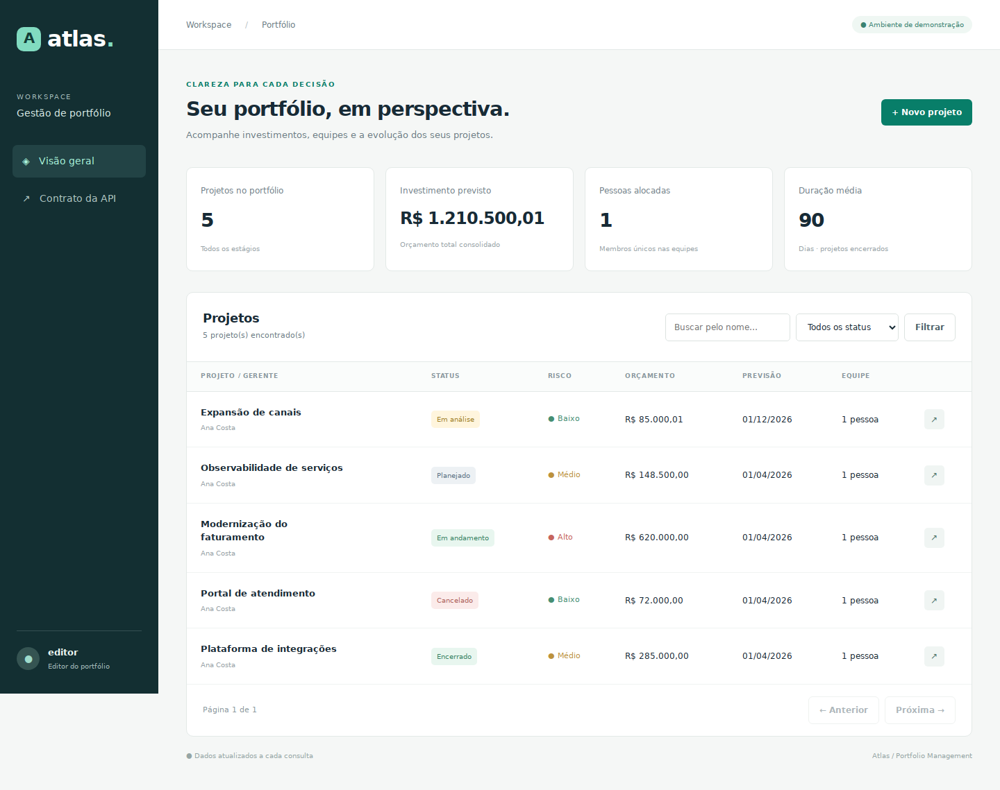

# Atlas — Portfólio de projetos

Gerenciamento de projetos com **Java 17, jCompany Community 1.2 adaptado, MVC2, JPA/Hibernate e PostgreSQL**. Inclui aplicação web, API REST documentada e um serviço externo simulado de membros, com implantação independente.



## Começar em poucos comandos

Requisito: Docker Engine/Desktop com Compose v2, disponível e iniciado. A primeira compilação precisa de acesso ao Maven Central. Portas locais: 8080 e 8081.

```bash
cp .env.example .env
# Edite as senhas de demonstração em .env.
docker compose up --build -d
```

No PowerShell, use `Copy-Item .env.example .env`. Os comandos Docker são os mesmos.

Acesse **http://localhost:8080/portfolio/dashboard** e autentique com `APP_USER`/`APP_PASSWORD` definidos no `.env`. O perfil `VIEWER_USER` permite consultar; somente o editor pode alterar projetos. O primeiro build executa testes e a verificação de cobertura. Aguarde os dois Tomcats inicializarem:

```bash
docker compose logs -f application members
```

O mock já possui funcionários de IDs 1–12 e uma gerente de ID 99. Crie seu primeiro projeto pela interface; não há projetos fictícios persistidos pela aplicação.

Para parar, use `docker compose down`. O volume PostgreSQL preserva os projetos. O mock de membros é intencionalmente volátil: cadastros adicionais desaparecem ao reiniciá-lo. **Não use `docker compose down -v` se quiser preservar o banco.**

## O que foi implementado

- CRUD com nome, descrição, datas, orçamento decimal, gerente, equipe, status e risco derivado.
- Sequência de status sem saltos; cancelamento e restrições de exclusão.
- Equipe de 1–10 funcionários e até 3 projetos ativos por membro, com proteção transacional contra concorrência.
- Versão otimista, respostas ETag, histórico de operações e erros sem detalhes internos.
- Filtro literal por nome, filtro por status, paginação e ordenação estável.
- Relatório por status, orçamento, duração média dos encerrados e pessoas únicas.
- Diretório externo HTTP com timeouts e validação de resposta; nenhuma rota de cadastro local de membros.
- Interface MVC2 responsiva, perfis de acesso no Tomcat, proteção de origem e cabeçalhos de segurança.
- OpenAPI, testes unitários, persistência, concorrência, HTTP real, JSP e mock externo.

## Framework e compatibilidade

| Componente | Versão / decisão |
| --- | --- |
| Java | JDK 17; fonte/bytecode Java 8 para preservar compatibilidade do código legado. Execução validada em Java 17; não prometemos Java 8. |
| jCompany | Community 1.2, módulos commons/model recompilados dos fontes recebidos |
| ORM | Hibernate EntityManager 3.6.10.Final / JPA 2.0, namespace `javax` |
| Servidor | Apache Tomcat 9.0.98 |
| REST | JAX-RS via Jersey 2.41 |
| Banco de execução | PostgreSQL 16.6 |
| Build | Maven 3.9.9, wrapper incluído |
| Testes | JUnit 5.11.4, Mockito 4.11.0, JaCoCo 0.8.12 |

O framework está disponível em [SourceForge](https://sourceforge.net/projects/jcompany/) e sua documentação em [jcompany.sourceforge.net](https://jcompany.sourceforge.net/). A referência alternativa do enunciado é o [portal Jaguar](https://softwarepublico.gov.br/social/jaguar).

**Instalação adotada:** os fontes originais necessários já acompanham `jcompany-runtime`. O Maven compila esse módulo antes da aplicação; não é necessário baixar o ZIP antigo nem instalar JARs manualmente. O exemplo `1.1-SNAPSHOT` foi usado somente como referência de convenções, não como dependência.

As dependências antigas customizadas e o snapshot OpenWebBeans foram substituídos por versões explícitas. Duas adaptações de fonte estão em [jcompany-compatibility.patch](docs/jcompany-compatibility.patch). Entidades, serviço, fachada e DAO herdam classes reais do jCompany; a inserção usa o método original `PlcBaseJpaDAO.insert`.

A camada visual é Servlet/JSP MVC2 com ações REST JAX-RS; não é uma migração integral do JSF/Trinidad/Seam do pacote original. Esta é uma **adaptação documentada**, não uma distribuição oficial do framework. Veja [arquitetura e decisões](docs/ARCHITECTURE.md) e [licenças](THIRD_PARTY_NOTICES.md).

## Testar sem Docker

Instale um JDK 17 e execute na raiz:

```bash
./mvnw clean verify
```

No Windows:

```powershell
.\mvnw.cmd clean verify
```

O teste padrão usa H2 apenas no escopo de testes, Hibernate real e Tomcat embarcado. O WAR de execução não inclui H2. O gate do JaCoCo exige **70% das linhas de `domain` + `service`**; os relatórios também mostram cobertura de decisões. Código de terceiros, DTOs e interface não inflam esse denominador.

Relatório HTML: `portfolio-app/target/site/jacoco/index.html`. Resultados JUnit: `portfolio-app/target/surefire-reports` e `members-mock/target/surefire-reports`.

### Executar o contrato de persistência no PostgreSQL

Use um banco de testes e um usuário com permissão de criar schemas. O teste cria um schema com UUID, aplica o SQL real, valida os mapeamentos e remove **apenas esse schema** ao terminar.

```bash
export TEST_POSTGRES_URL=jdbc:postgresql://localhost:5432/portfolio_test
export TEST_POSTGRES_USER=portfolio_test
export TEST_POSTGRES_PASSWORD=sua_senha_de_teste
./mvnw verify
```

PowerShell: `$env:TEST_POSTGRES_URL="jdbc:postgresql://localhost:5432/portfolio_test"` e o mesmo padrão para usuário/senha. O pipeline em `.github/workflows/verify.yml` fornece PostgreSQL e executa esse modo automaticamente. O teste HTTP usa seu próprio banco H2 isolado.

Consulte [VALIDATION.md](docs/VALIDATION.md) para os resultados efetivamente executados nesta entrega e as verificações ainda dependentes de ambiente.

## API e exemplos

Contrato OpenAPI: [openapi.yaml](portfolio-app/src/main/webapp/openapi.yaml), também servido em `http://localhost:8080/portfolio/openapi.yaml`. Pode ser importado no Swagger Editor ou Postman. O contrato é estático para não acoplar geração de documentação ao runtime legado.

| Método | Rota sob `/portfolio/api` | Permissão |
| --- | --- | --- |
| GET | `/projects?name=portal&status=EM_ANALISE&page=0&size=20` | viewer/editor |
| GET | `/projects/{id}` | viewer/editor |
| POST | `/projects` | editor |
| PUT | `/projects/{id}` | editor + versão no JSON |
| PATCH | `/projects/{id}/status` | editor + versão no JSON |
| DELETE | `/projects/{id}` | editor + `If-Match: "versão"` |
| GET | `/portfolio/report` | viewer/editor |
| GET | `/members` | viewer/editor; consulta o serviço externo |

Exemplo de criação (salve como `project.json`):

```json
{
  "name": "Plataforma de integrações",
  "description": "Evolução incremental das integrações digitais.",
  "startDate": "2026-09-01",
  "expectedEndDate": "2026-12-01",
  "budget": 100000.00,
  "managerId": 99,
  "memberIds": [1, 2]
}
```

```bash
curl -u editor:SUA_SENHA -H 'Content-Type: application/json' \
  --data-binary @project.json http://localhost:8080/portfolio/api/projects
```

No Windows utilize `curl.exe` e adapte a continuação de linha, ou execute em uma única linha. Valores monetários são enviados como números JSON e retornam como strings decimais exatas, preservando centavos no JavaScript. Campos de status/data real enviados no CRUD são rejeitados; alterações de estado usam o endpoint específico.

Para cadastrar um membro **na API externa**:

```bash
curl -u directory:SENHA_DO_DIRETORIO -H 'Content-Type: application/json' \
  -d '{"name":"Nova pessoa","role":"funcionário"}' \
  http://localhost:8081/members-mock/members
```

Consultas externas: `GET /members-mock/members` e `GET /members-mock/members/{id}`. O cargo aceito para equipe é `funcionário`, sem distinção de maiúsculas e com remoção de espaços externos.

## Estrutura

```text
jcompany-runtime/   Fontes reais do framework, manifesto e POM de compatibilidade
portfolio-app/      MVC2, REST, domínio, serviço, fachada, DAO, DTOs e testes
members-mock/       Serviço externo independente de membros
database/          Migração inicial PostgreSQL
docs/              Decisões, evidências, roteiro e patch do legado
```

## Binários incluídos

A pasta `dist/` do ZIP contém os dois WARs compilados e um relatório de cobertura. Ela está no `.gitignore`, para que binários e relatórios gerados não sejam enviados ao repositório de código. Você também pode reproduzir tudo com `./mvnw verify`.

## Implantação manual

`./mvnw package` produz `portfolio-app/target/portfolio.war` e `members-mock/target/members-mock.war`. Use Tomcat 9.0.98 e JDK 17. Aplique `database/001-schema.sql` em um banco PostgreSQL vazio. Configure as variáveis de `.env.example`, mais `DB_URL`, `DB_USER` e `MEMBERS_URL` conforme seu ambiente. Variáveis do `.env` são carregadas pelo Compose; o Tomcat manual exige exportá-las no processo.

No Tomcat da aplicação, cadastre usuários e roles `editor`/`viewer` em `conf/tomcat-users.xml`. No Tomcat externo, use a role `directory`. O `docker/StartServer.java` demonstra a criação segura do XML a partir do ambiente. Use `JAVA_OPTS="--add-opens=java.base/java.lang=ALL-UNNAMED -Duser.timezone=UTC"`. Não use Tomcat 10+, pois este projeto depende de `javax`, não de `jakarta`.

## Repositório e validação contínua

Código-fonte: [victoordasilvaa/atlas-portfolio](https://github.com/victoordasilvaa/atlas-portfolio).

```bash
git clone https://github.com/victoordasilvaa/atlas-portfolio.git
cd atlas-portfolio
./mvnw verify
```

O workflow `Verify` executa a suíte de persistência com PostgreSQL real e um smoke test dos WARs por Docker Compose. O smoke verifica criação, consulta, exclusão, relatório, compilação da JSP e autorização de leitura/escrita. Os relatórios Surefire e JaCoCo ficam disponíveis nos artefatos da execução.

O `.gitignore` exclui senhas, builds e artefatos locais. Consulte as [evidências de validação](docs/VALIDATION.md) e o [roteiro de apresentação](docs/DEMO.md).
