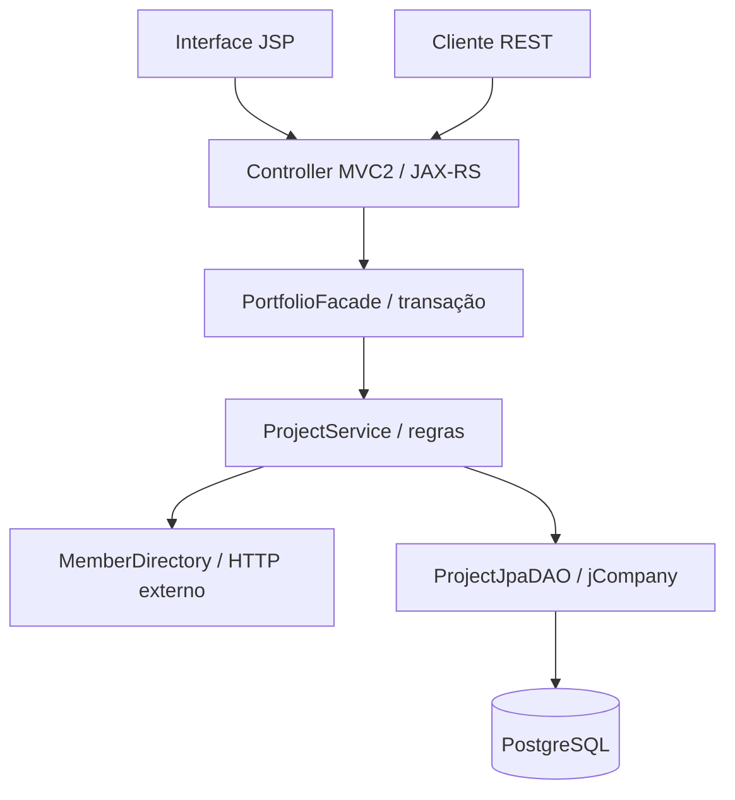

# Arquitetura e decisões

## Caminho de execução

A interface é servida por `DashboardController`, que encaminha para JSP protegida em WEB-INF. As ações utilizam JAX-RS. O serviço não conhece HTTP, e a persistência não conhece DTOs de entrada de projetos. O mapeamento de saída acontece dentro da transação, antes de fechar EntityManager; nenhuma entidade Hibernate é serializada pelo REST.

O projeto usa **código real do jCompany**, não classes falsas com nomes semelhantes: `Project` e `Member` herdam `PlcBaseMapEntity`; `ProjectService` herda `PlcBaseAS`; `PortfolioFacade` herda `PlcBaseFacadeImpl`; `ProjectJpaDAO` herda `PlcBaseJpaDAO` e a inserção de projetos chama `super.insert`. O EntityManager é fornecido à abstração de persistência por composição explícita, sem depender do localizador antigo para inicializar uma aplicação standalone.

## ADR 001 — Runtime legado reproduzível

O ZIP recebido contém a distribuição Community 1.2. Seus POMs referenciam versões customizadas de Hibernate (`hibernate-plc`), um snapshot antigo de OpenWebBeans e repositórios históricos. O exemplo separado utiliza `1.1-SNAPSHOT`. Não é reproduzível simplesmente copiar esses POMs.

A solução compila os módulos commons/model a partir das fontes fornecidas, com um POM explícito. Não utiliza Spring. Mantém Hibernate na família 3, JPA `javax` e o framework no caminho de execução. Adapta o despacho de eventos à API pública CDI e implementa a interface JDBC atual do wrapper de DataSource. A aplicação não depende de eventos CDI; o contêiner Tomcat não fornece CDI e essa extensão permanece inativa.

JAX-RS é a extensão REST permitida no enunciado. A interface usa Servlet/JSP MVC2, não o stack visual JSF/Trinidad/Seam antigo. Isso reduz a superfície de incompatibilidade; **não reivindicamos compatibilidade integral com todo o gerador e todos os componentes visuais da distribuição original**. Os fontes vendor e seu manifesto permitem auditoria.

## ADR 002 — Risco sem lacunas

Alto prevalece sobre médio, que prevalece sobre baixo. Valores acima de 100.000,00 até 500.000,00 são médios, incluindo 100.000,01 (o enunciado deixa uma lacuna se interpretado literalmente como 100.001). Exatamente três meses ainda é baixo quando orçamento permite. Exatamente seis meses é médio. Usa-se `LocalDate.plusMonths`, não divisão de dias por 30. Risco deriva sempre da previsão e não da data de conclusão.

## ADR 003 — Invariantes de equipe e concorrência

Todo projeto nasce com 1–10 funcionários; o gerente pode possuir outro cargo e só consome vaga se estiver explicitamente na equipe. IDs não podem se repetir. Projetos em todos os status exceto encerrado/cancelado contam no limite de três.

A linha de `portfolio_guard` é bloqueada com `SELECT ... FOR UPDATE` em toda mutação. A consulta de capacidade e as gravações ocorrem na mesma transação READ COMMITTED, após adquirir a trava. Funciona entre múltiplas instâncias da aplicação e impede write skew. O custo é serializar gravações do portfólio: escolha consciente para escopo pequeno, fácil de revisar e testar. Evolução: bloqueios por membro em ordem estável e coordenação de todas as transições. O serviço externo é consultado **antes** da trava, com timeouts e sem retentativas automáticas.

`@Version` herdado e versão explícita nos comandos evitam perda de atualização por clientes desatualizados. Alteração de status tem endpoint próprio; PUT não aceita `status` nem `actualEndDate`.

## ADR 004 — Status e datas

A sequência é exatamente a do enunciado, incluindo iniciado antes de planejado. Cancelamento é permitido inclusive depois de encerrado ("a qualquer momento"); não existe reabertura. Repetir o status atual é idempotente se não alterar data. Data real é obrigatória ao encerrar, não pode anteceder início ou ultrapassar hoje UTC. Ajustar o início de um projeto concluído também preserva essa regra. A data real é preservada ao cancelar um encerrado.

A proteção de exclusão é literal: iniciado, em andamento e encerrado. Planejado pode ser excluído, mesmo já tendo passado por iniciado. Uma política baseada no histórico seria diferente e exigiria alinhamento.

Valores monetários são recebidos como números JSON e processados com BigDecimal. Nas respostas, são strings decimais exatas; o total é somado no servidor e o navegador formata as casas sem conversão para ponto flutuante. Identificadores fracionários são rejeitados, sem truncamento silencioso.

## ADR 005 — Membros e relatórios

O mock externo tem implantação separada, API própria e dados em memória. IDs 1–12 são funcionários e 99 é gerente. Reiniciar o mock apaga somente cadastros adicionais; snapshots locais históricos permanecem. A aplicação principal não expõe POST de membros. Em cada criação/edição, consulta a fonte externa e valida os cargos atuais. Uma futura alteração de cargo no diretório não reescreve retroativamente equipes sem um comando de edição.

Listagens e relatórios usam uma transação REPEATABLE READ para manter consistência entre consultas; mutações usam READ COMMITTED e a trava de coordenação.

O relatório inclui todos os status e equipes, inclusive arquivados. Duração média conta dias entre início e data real dos encerrados (sem dia extra inclusivo); retorna null se não houver encerrados. O gerente só entra nos membros únicos se estiver na equipe. Auditoria preserva operações após exclusão; não contém FK para o projeto excluído.

## Limites operacionais

Esta é uma adaptação para avaliação de uma tecnologia legada. Dependências antigas exigem avaliação antes de qualquer produção. Compose publica apenas em loopback. Basic Auth deve passar por TLS fora de localhost. O pool interno do Hibernate atende a demonstração; em produção, usar DataSource/pool gerenciado. Não há claim de performance em grande escala. Nenhuma credencial real acompanha o projeto.
